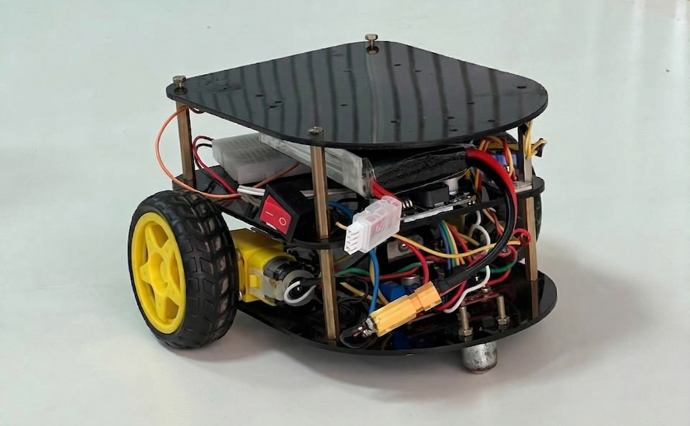
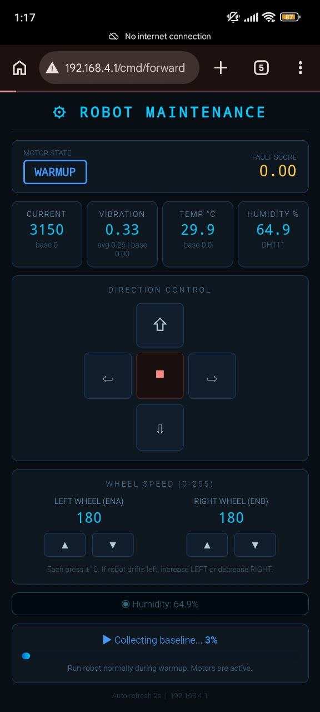
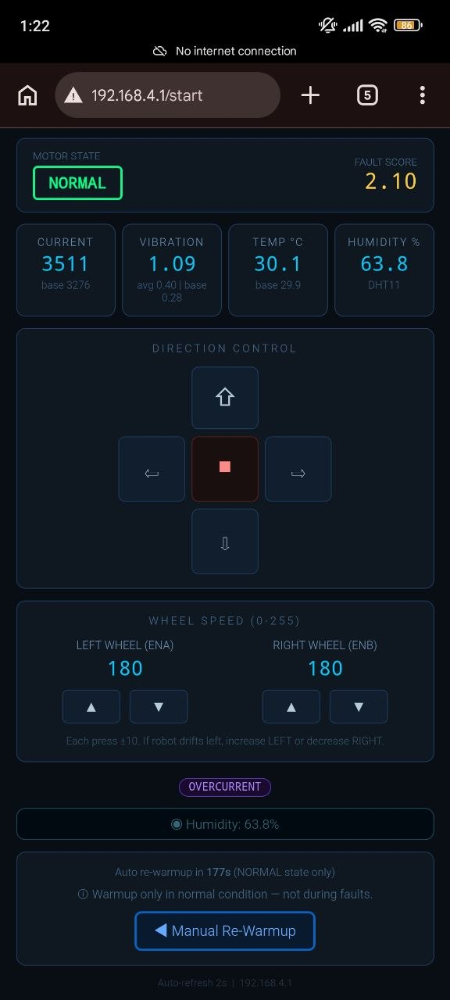
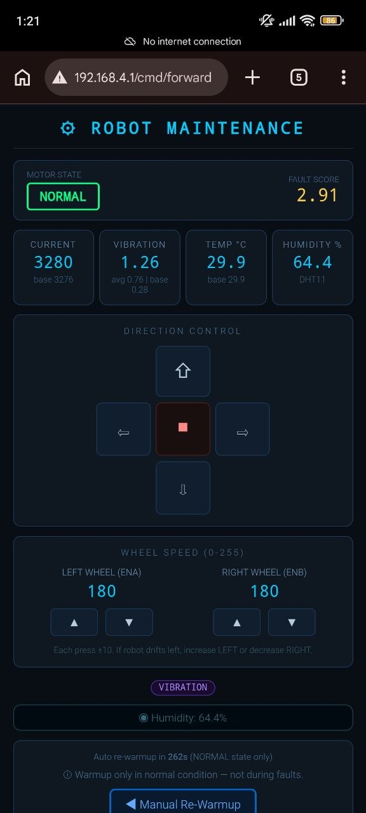
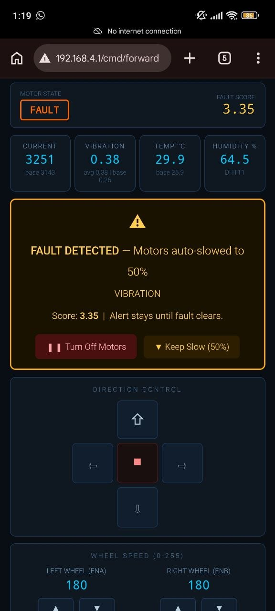
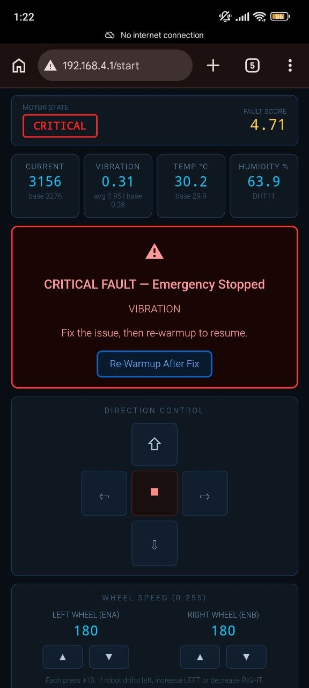
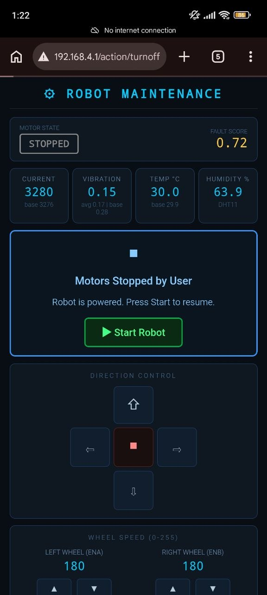
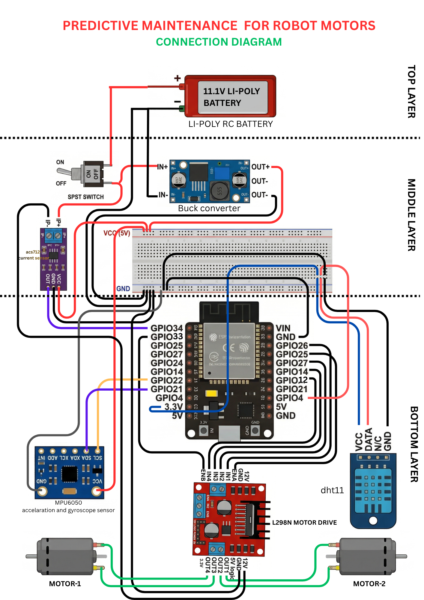

# 🤖 Predictive Maintenance Robot
### ESP32-Based Multi-Sensor Fault Detection System


---

## 📌 Introduction

This project presents a real-time predictive maintenance system implemented on a 2WD mobile robot using an ESP32 microcontroller. The objective is to detect motor faults reliably under real-world conditions **without relying on static datasets or pre-trained machine learning models**.

The system continuously monitors motor behavior using multiple sensors and identifies anomalies by comparing real-time data against a dynamically learned baseline. Based on the severity of detected deviations, the system automatically adjusts motor operation to prevent damage.

---

## ❗ Problem Statement

Initial attempts focused on building a machine learning model using collected datasets under three operating conditions:

- Normal
- Moving
- Blocked

While this approach worked in controlled conditions, it failed during repeated real-world testing. The primary issue observed was **sensor drift**, especially in current readings. The same motor produced different values across sessions due to variations in battery voltage, load conditions, and environmental factors.

This made the prebuilt dataset unreliable, as the trained model could not generalize to new conditions.

---

## 🔄 Key Design Shift

To overcome these limitations, the approach was redesigned.

Instead of training a model on fixed data, the system now:

- ✅ Learns its own "normal" behavior **at runtime**
- ✅ Uses **statistical methods** to detect deviations
- ✅ Eliminates dependency on pre-collected datasets

> The prebuilt dataset was not discarded entirely — it was used to understand the approximate operating range of sensor values. However, it is **not used for real-time decision-making**.

---

## 🏗️ System Architecture

### Hardware Components

| Component | Role |
|---|---|
| ESP32 Microcontroller | Main processing unit |
| L298N Motor Driver | Motor control |
| 2WD Robot Chassis + DC Motors | Locomotion |
| ACS712 Current Sensor | Motor load monitoring |
| MPU6050 Accelerometer | Vibration detection |
| DHT11 Temperature Sensor | Thermal monitoring |
| Buck Converter | Voltage regulation |
| Li-Po Battery | Power supply |

### Functional Layers

**Control Layer**
Handles motor control using PWM signals from the ESP32.

**Sensing Layer**
Collects real-time data from current, vibration, and temperature sensors.

**Processing Layer**
Performs filtering, baseline learning, anomaly detection, and decision-making.

---

## 🛠️ Development Process

### Step 1 — Basic Robot Implementation
A differential drive 2WD robot was built and controlled using the ESP32. Initial validation ensured stable motor control, proper power distribution, and reliable communication.

### Step 2 — Current Monitoring
The ACS712 current sensor was integrated to measure motor load. Data collection revealed that current values varied significantly between runs, even under similar conditions.

### Step 3 — Machine Learning Attempt
A dataset was created using different operating states and used to train a model. However, due to inconsistent sensor behavior, the model failed to provide reliable predictions.

> This step was critical in identifying the limitations of static ML approaches in embedded systems with variable hardware conditions.

### Step 4 — Multi-Sensor Integration
To improve reliability, additional sensors were introduced: MPU6050 for vibration analysis and DHT11 for temperature monitoring. This enabled a multi-dimensional understanding of motor health.

### Step 5 — Adaptive Baseline Implementation
A warmup phase was introduced at system startup. During this phase, the robot operates under assumed normal conditions and collects sensor data. From this data, the system computes the **mean** (average value) and **standard deviation** (natural variation). This baseline represents the normal operating condition for that specific session and remains fixed during operation.

---

## ⚙️ Core Detection Method

### Z-Score Based Anomaly Detection

The system uses statistical normalization to evaluate deviations:

```
Z = (current_value - baseline_mean) / baseline_std_dev
```

- Small Z values → normal operation
- Large Z values → potential fault
- Both positive and negative deviations are meaningful for current analysis

---

## 🔇 Noise Reduction Techniques

Raw sensor data contains noise that can lead to false detections. Two filtering techniques are used:

- **Median Filter** *(Vibration)* — Removes sudden spikes effectively
- **Moving Average** *(Current)* — Smooths short-term fluctuations

These filters ensure that only consistent anomalies are considered.

---

## 📊 Fault Scoring Mechanism

A unified fault score is computed using weighted contributions from sensors:

```
fault_score = (Z_current × 0.5) + (Z_vibration × 0.5)
```

Additional adjustments:
- Multi-sensor anomalies increase confidence
- Sudden spikes are given extra weight

This scoring system allows **gradual classification** of system health instead of binary decisions.

---

## 🔁 State Machine for Decision Making

To avoid false positives, the system uses a state machine with persistence logic.

```
WARMUP → NORMAL → WARNING → FAULT → CRITICAL
```

A fault is only confirmed if abnormal readings **persist across multiple cycles**. Similarly, recovery requires sustained normal behavior. This ensures stability and prevents reactions to transient noise.

---

## 🌐 Web Dashboard

The ESP32 hosts a real-time monitoring webpage accessible over Wi-Fi.



## 📸 Fault Detection in Action

### ⚡ Current Fault Triggered
When motor current exceeds the Z-score threshold, the system escalates the state and throttles the motor.



### 📳 IMU / Vibration Fault Triggered
When abnormal vibration is detected by the MPU6050, the system flags a mechanical anomaly.



### 📉 Fault Detection — Motors Slowing Down



When the system transitions into the **WARNING** or **FAULT** state, the motors are automatically throttled to a reduced speed. This happens when sensor Z-scores exceed the fault threshold consistently across multiple cycles, indicating an overload, blockage, or mechanical abnormality. Slowing the motors reduces stress and prevents further damage while the fault persists.

---

### ⚡ Critical Fault — Sudden Spike



A **CRITICAL** state is triggered when an abrupt, high-magnitude spike is detected in current or vibration readings — typically caused by a sudden jam, short circuit, or mechanical impact. The system immediately halts the motors and flags the event on the dashboard, distinguishing it from gradual fault buildup due to its instantaneous nature.

---

### 🛑 Motors Manually Stopped



The dashboard includes a **manual stop control** that allows the operator to immediately cut motor output regardless of the current system state. When triggered, the system holds the motors at zero speed and logs the event as a manual intervention, separate from any fault-driven stop.

---

## 🚨 Fault Interpretation

| Fault Type | Likely Cause |
|---|---|
| Overcurrent | Overload or blockage |
| Low Current | Disconnection or driver issues |
| High Vibration | Mechanical instability |
| Sudden Spike | Abrupt failure |
| Multi-Sensor Fault | Serious composite failure |

---

## 🔄 System Workflow

The complete process runs continuously on the ESP32 (~every **200ms**):

```
Sensor Data Acquisition
        ↓
  Signal Filtering
        ↓
 Baseline Comparison
        ↓
  Z-Score Computation
        ↓
   Fault Scoring
        ↓
  State Transition
        ↓
 Motor Control Action
```

---

## 📝 Key Observations

- Sensor values are not stable across sessions
- Fixed thresholds are ineffective
- Prebuilt datasets have limited real-world applicability
- Adaptive systems provide significantly better reliability

---

## ✅ Advantages

- No dependency on machine learning models
- Fully real-time and hardware-adaptive
- Robust against noise and transient spikes
- Computationally efficient (runs entirely on ESP32)
- Scalable to additional sensors

---

## ⚠️ Limitations

- Baseline accuracy depends on correct warmup conditions
- DHT11 has limited precision and slow response
- Long-term degradation tracking is not implemented
- No cloud-based monitoring or logging

---

## 🚀 Future Improvements

**🔋 Battery Monitoring Integration**
Add an additional current sensing mechanism to monitor overall battery consumption. This can be used to estimate remaining charge and trigger alerts or actions when the battery level drops below a safe threshold, ensuring timely recharging and preventing unexpected shutdowns.

**🔔 Buzzer-Based Alert System**
Integrate a buzzer to provide immediate audible feedback during critical fault conditions. This ensures that severe issues are noticeable even without monitoring the dashboard, improving safety and response time.

---

## 📐 System Architecture Diagram


---

## 📊 System Flowchart


---

## 🔌 Connection Diagram



---

# 🚀 Future Implementations

This document outlines potential improvements and extensions for anyone looking to build upon this project. Each idea is explained with what it does, why it is useful, and how it connects to the existing system.

---

## 📋 Table of Contents

1. [Cloud-Based Monitoring & Logging](#1--cloud-based-monitoring--logging)
2. [Battery Health Monitoring](#2--battery-health-monitoring)
3. [Buzzer-Based Alert System](#3--buzzer-based-alert-system)
4. [Mobile App Integration](#4--mobile-app-integration)
5. [OLED Display on Robot](#5--oled-display-on-robot)

---

## 1. ☁️ Cloud-Based Monitoring & Logging

### What it is
Send all sensor readings and fault events to a cloud platform in real time so they can be accessed from anywhere, not just the local Wi-Fi network.

### Why it is useful
Currently the dashboard only works when you are on the same Wi-Fi network as the robot. Cloud integration removes this limitation and also stores historical data permanently.

### How to implement
- Use platforms like **ThingSpeak**, **Firebase**, or **AWS IoT Core**
- ESP32 sends data via HTTP POST or MQTT protocol to the cloud
- Build a cloud dashboard using **Grafana** or the platform's built-in visualization tools
- Set up automated email or SMS alerts when a fault is logged

### Suggested Tools
`ThingSpeak` `Firebase Realtime Database` `MQTT` `AWS IoT` `Grafana`

---

## 2. 🔋 Battery Health Monitoring

### What it is
Add a dedicated voltage divider circuit or a fuel gauge IC to monitor the Li-Po battery voltage and estimate remaining charge.

### Why it is useful
A low battery causes the motors to draw inconsistent current, which directly affects baseline accuracy and can trigger false fault detections. Knowing battery level in advance prevents this.

### How to implement
- Use a simple **voltage divider** (two resistors) connected to an ESP32 ADC pin to read battery voltage
- Map the voltage to a percentage (e.g. 8.4V = 100%, 6.6V = 0% for a 2S Li-Po)
- Display battery percentage on the web dashboard
- Trigger a warning when battery drops below 20%
- Optionally use the **MAX17043** fuel gauge IC for more accurate readings

### Suggested Tools
`Voltage Divider Circuit` `MAX17043 IC` `ESP32 ADC`

---

## 3. 🔔 Buzzer-Based Alert System

### What it is
Add a piezo buzzer to the robot that beeps at different patterns based on the fault state.

### Why it is useful
The web dashboard requires someone to actively be watching it. A buzzer gives immediate physical feedback even when no one is monitoring the screen — especially useful in noisy or remote environments.

### How to implement
- Connect a piezo buzzer to any available GPIO pin on the ESP32
- Define beep patterns for each state:
  - 1 short beep → WARNING
  - 2 short beeps → FAULT DETECTED
  - Continuous rapid beeps → CRITICAL FAULT
- Use `tone()` or PWM to control beep frequency

### Suggested Tools
`Piezo Buzzer` `ESP32 PWM` `GPIO Output`

---

## 4. 📱 Mobile App Integration

### What it is
Build a dedicated mobile app for Android or iOS that connects to the robot and displays the dashboard instead of using a browser.

### Why it is useful
A native app provides push notifications, a better mobile UI, and can work even when the browser tab is closed. It also allows background monitoring.

### How to implement
- Use **MIT App Inventor** for a quick no-code Android app
- Or build with **Flutter** for a cross-platform (Android + iOS) app
- Connect the app to the ESP32 using WebSockets or HTTP requests
- Add push notifications using **Firebase Cloud Messaging (FCM)** when a fault is detected

### Suggested Tools
`Flutter` `MIT App Inventor` `WebSockets` `Firebase FCM`

---

## 5. 🖥️ OLED Display on Robot

### What it is
Mount a small OLED screen directly on the robot to show live sensor data and fault status without needing to open the dashboard.

### Why it is useful
Gives instant on-device feedback during testing or demos without needing a phone or laptop. Very useful when debugging in the field.

### How to implement
- Use a **0.96 inch SSD1306 OLED** module (I2C, same bus as MPU6050)
- Display current state, fault score, and motor status on screen
- Scroll through sensor values every few seconds
- Show a simple icon or symbol for each fault type

### Suggested Tools
`SSD1306 OLED` `Adafruit SSD1306 Library` `I2C`

---

---

## 🤝 Contributing

If you have implemented any of the above or have a new idea entirely, feel free to:

1. Fork this repository
2. Create a new branch (`git checkout -b feature/your-feature-name`)
3. Make your changes and commit (`git commit -m "Add: your feature description"`)
4. Push to your branch (`git push origin feature/your-feature-name`)
5. Open a **Pull Request** with a clear description of what you added

> 💡 Even partial implementations or proof-of-concept additions are welcome. Open an Issue first if you want to discuss an idea before building it.

## 🏁 Conclusion

This project demonstrates a shift from a traditional machine learning approach to a more practical, adaptive system suitable for embedded environments.

By allowing the system to define its own baseline and detect deviations in real time, the solution becomes more **robust**, **scalable**, and aligned with real-world predictive maintenance principles.
