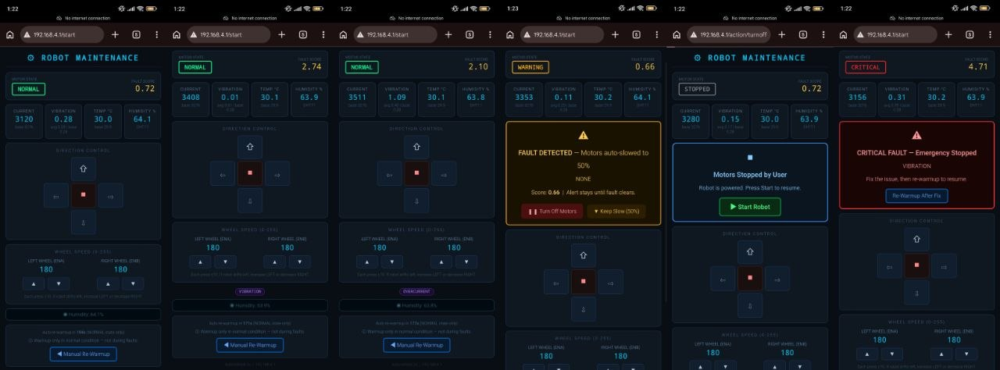

# 🤖 Predictive Maintenance Robot
### ESP32-Based Multi-Sensor Fault Detection System


---

## 📌 Introduction

This project presents a real-time predictive maintenance system implemented on a 2WD mobile robot using an ESP32 microcontroller. The objective is to detect motor faults reliably under real-world conditions **without relying on static datasets or pre-trained machine learning models**.

The system continuously monitors motor behavior using multiple sensors and identifies anomalies by comparing real-time data against a dynamically learned baseline. Based on the severity of detected deviations, the system automatically adjusts motor operation to prevent damage.

---

## ❗ Problem Statement

Initial attempts focused on building a machine learning model using collected datasets under three operating conditions:

- Normal
- Moving
- Blocked

While this approach worked in controlled conditions, it failed during repeated real-world testing. The primary issue observed was **sensor drift**, especially in current readings. The same motor produced different values across sessions due to variations in battery voltage, load conditions, and environmental factors.

This made the prebuilt dataset unreliable, as the trained model could not generalize to new conditions.

---

## 🔄 Key Design Shift

To overcome these limitations, the approach was redesigned.

Instead of training a model on fixed data, the system now:

- ✅ Learns its own "normal" behavior **at runtime**
- ✅ Uses **statistical methods** to detect deviations
- ✅ Eliminates dependency on pre-collected datasets

> The prebuilt dataset was not discarded entirely — it was used to understand the approximate operating range of sensor values. However, it is **not used for real-time decision-making**.

---

## 🏗️ System Architecture

### Hardware Components

| Component | Role |
|---|---|
| ESP32 Microcontroller | Main processing unit |
| L298N Motor Driver | Motor control |
| 2WD Robot Chassis + DC Motors | Locomotion |
| ACS712 Current Sensor | Motor load monitoring |
| MPU6050 Accelerometer | Vibration detection |
| DHT11 Temperature Sensor | Thermal monitoring |
| Buck Converter | Voltage regulation |
| Li-Po Battery | Power supply |

### Functional Layers

**Control Layer**
Handles motor control using PWM signals from the ESP32.

**Sensing Layer**
Collects real-time data from current, vibration, and temperature sensors.

**Processing Layer**
Performs filtering, baseline learning, anomaly detection, and decision-making.

---

## 🛠️ Development Process

### Step 1 — Basic Robot Implementation
A differential drive 2WD robot was built and controlled using the ESP32. Initial validation ensured stable motor control, proper power distribution, and reliable communication.

### Step 2 — Current Monitoring
The ACS712 current sensor was integrated to measure motor load. Data collection revealed that current values varied significantly between runs, even under similar conditions.

### Step 3 — Machine Learning Attempt
A dataset was created using different operating states and used to train a model. However, due to inconsistent sensor behavior, the model failed to provide reliable predictions.

> This step was critical in identifying the limitations of static ML approaches in embedded systems with variable hardware conditions.

### Step 4 — Multi-Sensor Integration
To improve reliability, additional sensors were introduced: MPU6050 for vibration analysis and DHT11 for temperature monitoring. This enabled a multi-dimensional understanding of motor health.

### Step 5 — Adaptive Baseline Implementation
A warmup phase was introduced at system startup. During this phase, the robot operates under assumed normal conditions and collects sensor data. From this data, the system computes the **mean** (average value) and **standard deviation** (natural variation). This baseline represents the normal operating condition for that specific session and remains fixed during operation.

---

## ⚙️ Core Detection Method

### Z-Score Based Anomaly Detection

The system uses statistical normalization to evaluate deviations:

```
Z = (current_value - baseline_mean) / baseline_std_dev
```

- Small Z values → normal operation
- Large Z values → potential fault
- Both positive and negative deviations are meaningful for current analysis

---

## 🔇 Noise Reduction Techniques

Raw sensor data contains noise that can lead to false detections. Two filtering techniques are used:

- **Median Filter** *(Vibration)* — Removes sudden spikes effectively
- **Moving Average** *(Current)* — Smooths short-term fluctuations

These filters ensure that only consistent anomalies are considered.

---

## 📊 Fault Scoring Mechanism

A unified fault score is computed using weighted contributions from sensors:

```
fault_score = (Z_current × 0.5) + (Z_vibration × 0.5)
```

Additional adjustments:
- Multi-sensor anomalies increase confidence
- Sudden spikes are given extra weight

This scoring system allows **gradual classification** of system health instead of binary decisions.

---

## 🔁 State Machine for Decision Making

To avoid false positives, the system uses a state machine with persistence logic.

```
WARMUP → NORMAL → WARNING → FAULT → CRITICAL
```

A fault is only confirmed if abnormal readings **persist across multiple cycles**. Similarly, recovery requires sustained normal behavior. This ensures stability and prevents reactions to transient noise.

---

## 🌐 Web Dashboard



# 🚨 Real-Time Fault Detection Demonstrations
## 📳 Vibration Fault Detection


## ⚡️ Multi-Sensor Fault Detection


## ⚠️ Obstacle-Induced Fault Detection


---

## 🚨 Fault Interpretation

| Fault Type | Likely Cause |
|---|---|
| Overcurrent | Overload or blockage |
| Low Current | Disconnection or driver issues |
| High Vibration | Mechanical instability |
| Sudden Spike | Abrupt failure |
| Multi-Sensor Fault | Serious composite failure |

---

## 🔄 System Workflow

The complete process runs continuously on the ESP32 (~every **200ms**):

```
Sensor Data Acquisition
        ↓
  Signal Filtering
        ↓
 Baseline Comparison
        ↓
  Z-Score Computation
        ↓
   Fault Scoring
        ↓
  State Transition
        ↓
 Motor Control Action
```

---

## 🚀 Getting Started

### 🛒 What You Need

#### Hardware

| Component | Quantity | Notes |
|---|---|---|
| ESP32 Development Board | 1 | Any 38-pin ESP32 dev board works |
| L298N Motor Driver | 1 | — |
| 2WD Robot Chassis with DC Motors | 1 | Comes with wheels and motor mounts |
| ACS712 Current Sensor | 1 | 5A or 20A version |
| MPU6050 Accelerometer/Gyroscope | 1 | GY-521 module recommended |
| DHT11 Temperature Sensor | 1 | With pull-up resistor on board preferred |
| Buck Converter | 1 | Set to output 5V |
| Li-Po Battery | 1 | 7.4V 2S recommended |
| Jumper Wires | Several | Male-to-male and male-to-female |
| Breadboard | 1 | For prototyping connections |
| USB Cable (Micro or USB-C) | 1 | Matching your ESP32 board |

#### Software

- Arduino IDE (version 2.x recommended)
- Web browser (Chrome or Firefox) for the dashboard

---

### 🔌 Wiring & Hardware Assembly

> ⚠️ **Do all wiring with the battery disconnected. Double-check every connection before powering on.**

Refer to the [Connection Diagram](connection_diagram1.png) for the full visual reference.

#### ESP32 → L298N Motor Driver

| ESP32 Pin | L298N Pin | Purpose |
|---|---|---|
| GPIO 26 | IN1 | Left motor direction |
| GPIO 27 | IN2 | Left motor direction |
| GPIO 14 | IN3 | Right motor direction |
| GPIO 12 | IN4 | Right motor direction |
| GPIO 25 | ENA (PWM) | Left motor speed |
| GPIO 33 | ENB (PWM) | Right motor speed |
| GND | GND | Common ground |

#### ESP32 → ACS712 Current Sensor

| ESP32 Pin | ACS712 Pin | Purpose |
|---|---|---|
| 3.3V | VCC | Power |
| GND | GND | Ground |
| GPIO 34 (ADC) | OUT | Analog current reading |

#### ESP32 → MPU6050

| ESP32 Pin | MPU6050 Pin | Purpose |
|---|---|---|
| 3.3V | VCC | Power |
| GND | GND | Ground |
| GPIO 21 | SDA | I2C Data |
| GPIO 22 | SCL | I2C Clock |

#### ESP32 → DHT11

| ESP32 Pin | DHT11 Pin | Purpose |
|---|---|---|
| 3.3V | VCC | Power |
| GND | GND | Ground |
| GPIO 4 | DATA | Temperature/Humidity |

#### Power Distribution

- Li-Po battery → Buck converter input
- Buck converter output (5V) → L298N 5V pin (logic power) and ESP32 VIN
- L298N 12V pin → Li-Po battery positive (motor power)
- All GND pins must share a **common ground**

> 💡 **Tip:** The ESP32 runs on 3.3V logic internally but the VIN pin accepts 5V. Always power sensors with 3.3V from the ESP32 unless the sensor specifically requires 5V.

---

### ⚙️ Setting Up Arduino IDE for ESP32

**Step 1** — Open Arduino IDE and go to `File` → `Preferences`

**Step 2** — In the **"Additional Boards Manager URLs"** field, paste:
```
https://raw.githubusercontent.com/espressif/arduino-esp32/gh-pages/package_esp32_index.json
```

**Step 3** — Go to `Tools` → `Board` → `Boards Manager`, search for `esp32`, and install the package by **Espressif Systems**.

**Step 4** — Select your board: `Tools` → `Board` → `ESP32 Arduino` → `ESP32 Dev Module`

**Step 5** — Set upload settings:

| Setting | Value |
|---|---|
| Upload Speed | 115200 |
| CPU Frequency | 240MHz |
| Flash Size | 4MB |
| Partition Scheme | Default 4MB |
| Port | COMx (Windows) or /dev/ttyUSBx (Linux/Mac) |

Also install the **CP2102 or CH340 USB driver** for your ESP32 board to be recognized by your computer.

---

### 📦 Installing Required Libraries

Go to `Sketch` → `Include Library` → `Manage Libraries` and install:

| Library | Author | Purpose |
|---|---|---|
| `MPU6050` | Electronic Cats or Jeff Rowberg | Accelerometer/Gyroscope |
| `DHT sensor library` | Adafruit | DHT11 temperature sensor |
| `Adafruit Unified Sensor` | Adafruit | Dependency for DHT library |
| `AsyncTCP` | dvarrel | Async TCP for web server |
| `Wire` | Built-in | I2C communication (no install needed) |

---

### 📤 Uploading the Code

**Step 1** — Clone or download this repository:
```bash
git clone https://github.com/YOUR_USERNAME/YOUR_REPO_NAME.git
```

**Step 2** — Open `robot_maintenance_v4_final.ino` from `codes/working_final_versions/` in Arduino IDE.

**Step 3** — Connect the ESP32 via USB, select the correct board and port under `Tools`.

**Step 4** — Click the **Upload** button (→ arrow icon) and wait for `Done uploading.`

> ⚠️ If upload fails with "Connecting…" stuck, hold the **BOOT button** on the ESP32 while the upload starts, then release once you see "Connecting…"

---

### ⏱️ Understanding the Warmup Phase

The warmup phase is **critical** to the system working correctly.

- Runs automatically for the first few seconds after boot
- The robot moves under **normal load conditions** during this time
- The system computes the **mean and standard deviation** for current and vibration as the session baseline

> ⚠️ **Do not block the wheels, apply extra load, or disturb the robot during warmup.** Any abnormal condition will skew the baseline and cause false detections for the entire session.

> 💡 If warmup was disrupted, press the **EN/RST button** to restart a fresh warmup.

---

### 🌐 Accessing the Web Dashboard

**Step 1** — Connect your phone or computer to the ESP32's Wi-Fi:
- **SSID:** `ESP32_ROBOT`
- **Password:** `12345678`
- turn off the mobile data of your smartphone for working...

**Step 2** — Find the ESP32's IP from the Serial Monitor:
```
[WIFI] Connected! IP: 192.168.4.1
```

**Step 3** — Open a browser and go to `http://192.168.x.x`

---

### 📊 Reading the Dashboard

| Display Element | What It Means |
|---|---|
| Current (A) | Live motor current draw |
| Vibration Level | MPU6050 vibration intensity |
| Temperature (°C) | DHT11 ambient reading |
| Humidity level | DHT11 humidity reading |
| Fault Score | Weighted anomaly score (0 = normal) |
| System State | WARMUP / NORMAL / WARNING / FAULT / CRITICAL |
| Motor Status | Running / Slowed Down / Stopped |

**System State Meanings:**
- 🟢 **NORMAL** — All readings within baseline range. Motors at full speed.
- 🟡 **WARNING** — Minor deviation detected. System monitoring closely.
- 🟠 **FAULT DETECTED** — Significant anomaly confirmed. Motors automatically slow down.
- 🔴 **CRITICAL FAULT** — Sudden spike detected. Motors halted immediately.
- ⛔ **MOTORS MANUALLY STOPPED** — User stopped motors via dashboard.

---

### 🧪 Testing Fault Detection

**Test 1 — Fault Detection (Motor Slowdown)**
Gently press down on the chassis to increase wheel load. Expect: current rise → fault score increase → **FAULT** state → motors slow down.

**Test 2 — Critical Fault (Sudden Spike)**
Abruptly block both wheels for 1–2 seconds. Expect: sudden spike in current and vibration → **CRITICAL** state → motors stop.

**Test 3 — Manual Stop**
Click **Stop Motors** on the dashboard during any fault. Expect: motors stop immediately, dashboard shows **MOTORS MANUALLY STOPPED**.

**Test 4 — Recovery**
Release all load and let the robot run freely. After sustained normal readings, the system transitions back to **NORMAL** state.

---

### 🔧 Troubleshooting

| Problem | Likely Cause | Fix |
|---|---|---|
| ESP32 not detected by PC | Missing USB driver | Install CP2102 or CH340 driver |
| Upload fails | Wrong COM port or board | Recheck Tools → Board and Tools → Port |
| Upload fails with "Connecting…" stuck | Not entering flash mode | Hold BOOT button during upload start |
| Wi-Fi not connecting | Wrong credentials | Double-check ssid and password in code |
| Dashboard not loading | Wrong network or IP | Ensure correct Wi-Fi; recheck IP from Serial Monitor |
| False faults after warmup | Warmup was disturbed | Reset ESP32 and redo warmup cleanly |
| No current readings / always 0 | ACS712 wiring issue | Check VCC, GND, and OUT connections |
| MPU6050 not responding | I2C wiring issue | Verify SDA/SCL pins; run I2C scanner sketch |
| DHT11 shows -1 or NaN | Bad data pin or no pull-up | Check DATA pin; add 10kΩ pull-up resistor if needed |
| Motors not moving | L298N not powered or wrong pins | Check motor driver wiring and PWM pin assignments |

---

### 📌 Important Notes & Tips

- 🔁 **Always reset before a new session.** The baseline is session-specific and does not persist after power off.
- 🔋 **Monitor battery voltage.** A low battery causes inconsistent current readings and false detections.
- 🌡️ **DHT11 has a 1–2 second response delay.** It is used for long-term trend monitoring only.
- ⚡ **Never connect the Li-Po battery in reverse polarity.**
- 🧰 **Verify buck converter output is exactly 5V** with a multimeter before connecting to the ESP32.
- 💾 **Do not modify the baseline computation** section unless you fully understand the implications.

---

## 📝 Key Observations

- Sensor values are not stable across sessions
- Fixed thresholds are ineffective
- Prebuilt datasets have limited real-world applicability
- Adaptive systems provide significantly better reliability

---

## ✅ Advantages

- No dependency on machine learning models
- Fully real-time and hardware-adaptive
- Robust against noise and transient spikes
- Computationally efficient (runs entirely on ESP32)
- Scalable to additional sensors

---

## ⚠️ Limitations

- Baseline accuracy depends on correct warmup conditions
- DHT11 has limited precision and slow response
- Long-term degradation tracking is not implemented
- No cloud-based monitoring or logging

---

## 🚀 Future Improvements

**🔋 Battery Monitoring Integration**
Add an additional current sensing mechanism to monitor overall battery consumption. This can be used to estimate remaining charge and trigger alerts or actions when the battery level drops below a safe threshold, ensuring timely recharging and preventing unexpected shutdowns.

**🔔 Buzzer-Based Alert System**
Integrate a buzzer to provide immediate audible feedback during critical fault conditions. This ensures that severe issues are noticeable even without monitoring the dashboard, improving safety and response time.

---

## 📐 System Architecture Diagram


---

## 📊 System Flowchart


---

## 🔌 Connection Diagram


---

## 🏁 Conclusion

This project demonstrates a shift from a traditional machine learning approach to a more practical, adaptive system suitable for embedded environments.

By allowing the system to define its own baseline and detect deviations in real time, the solution becomes more **robust**, **scalable**, and aligned with real-world predictive maintenance principles.
